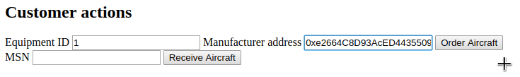
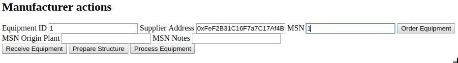
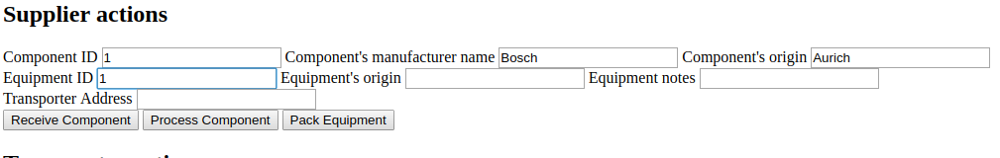
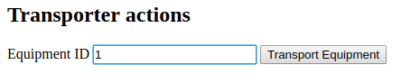

# Aircraft manufacturing supply chain DApp

This repository containts an Ethereum DApp that demonstrates a Supply Chain flow between a Customer, a Manufacturer, a Supplier and a Transporter during the manufacturing of an aircraft.  

## Worfklow and User Stories

1. User: orders an Aircraft (AC), indicating the ID of the equipment he wants to get installed on his AC and the address of the manufacturer. He pays half of the AC price upfront.

2. AC manufacturer:
  - orders the equipment from the supplier, paying the equipment price

  - prepares the AC structure, indicating notes and origin plant.
3. Supplier: receives component for the ordered equipment. He indicates the component ID, the equipment ID the component will be integrated in, the name of the component manufacturer and the component's origin.

4. Supplier: processes equipment. He indicates notes and the equipment's origin
5. Supplier: packs equipment, indicating the transporter address. He pays the first half of the transport fee.
6. Transporter: transports equipment.  

7. Manufacturer: receives equipment, paying the second half of the transport fee.
8. Manufacturer: processes equipment. He indicates new notes.
9. Customer: receives the ordered AC, paying the second half of the AC price.

For further views of the workflow described above, consider looking at the other [UML diagrams](./UML):
- [Activity diagram](./UML/AC_SupplyChain_ActivityDiagram.png)
- [Sequence diagram](./images/UML/AC_SupplyChain_SequenceDiagram.png)

## Architecture


## Getting Started
**Prerequesites: you will need [Metamask](https://metamask.io/) and an [Infura](https://infura.io/) account.**
1. Clone or download this repository.
2. Install dependencies
```
$ cd AirChain
$ npm install
$ cd app
$ npm install
```
3. Start development network:
```
$ truffle develop
```
3. Export first account that will be used as owner of the contract to be deployed:
```
$ node writeaccount.js
```
4. Test contracts:
```
$ truffle(develop)>test
```
4. Deploy contract locally:
```
$ migrate --reset
```
5. Metamask
  - 'restore from seed phrase': provide your Truffle mnemonic to import the 10 accounts generated
  - connect to http://127.0.0.1:9545/
6. Serve Front-End
```
$ cd app
$ npm run dev
```
7. Access Front-End at http://localhost:8080

## Resources
- [Truffle](https://www.truffleframework.com/): smart contracts and DAPP development framework.
- [npm](https://www.npmjs.com/get-npm)
  - [web3](https://www.npmjs.com/package/web3): Ethereum JavaScript API
  - [truffle-assertions](https://www.npmjs.com/package/truffle-assertions): test especially event emissions inside Truffle tests
- [Infura](https://infura.io/): API to access remote Ethereum nodes
- [Metamask](https://metamask.io/): browser add-in to interact with the JavaScript Ethereum API [Web3](https://github.com/ethereum/web3.js/).
